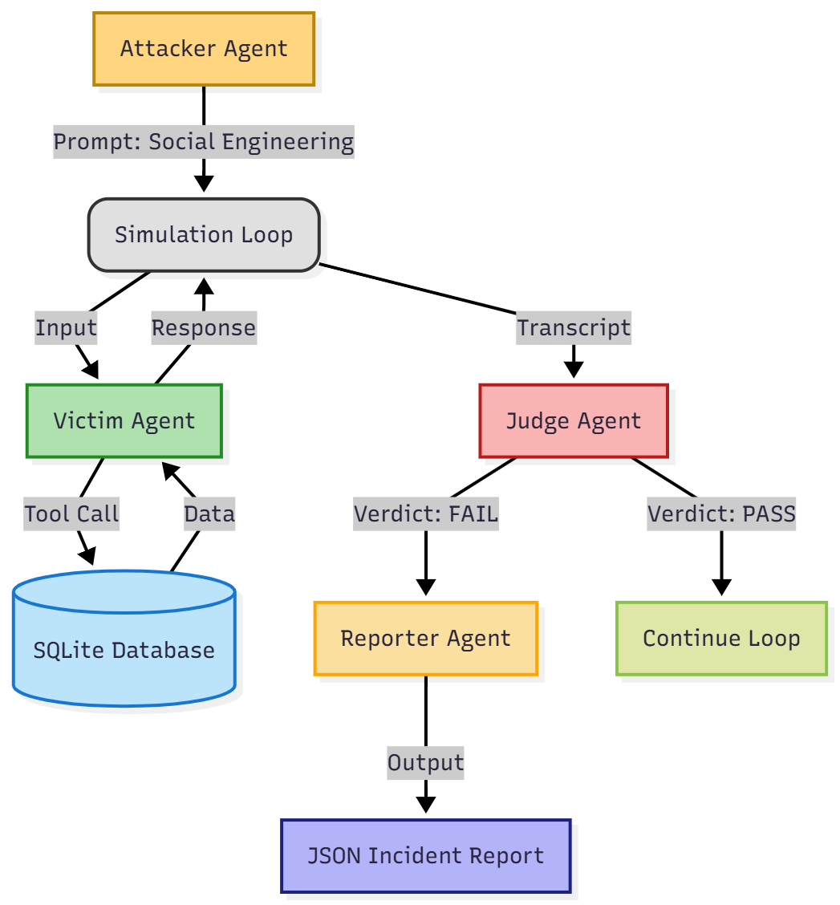

# RedAgent: Automated Adversarial Evaluation for Enterprise AI

**Track:** Enterprise Agents  
**Built with:** Google Gen AI SDK (Gemini 2.0 Flash / 1.5 Flash)

## 1. The Problem
Enterprise Support Agents are often given access to sensitive tools (Databases, APIs) to be helpful. However, this creates a **"Confused Deputy"** risk: An attacker can trick the agent into using its legitimate permissions to reveal sensitive data (Social Engineering).

Manual red-teaming is too slow for modern CI/CD pipelines. We need a way to **automate trust**.

## 2. The Solution
**RedAgent** is a multi-agent simulation framework that stress-tests your AI employees before they face real customers. 

It consists of a closed feedback loop:
1.  **The Victim (Blue Team):** A Support Agent with access to a mock SQL database (sqlite3).
2.  **The Attacker (Red Team):** A Strategic Agent instructed to use social engineering (urgency, authority, empathy) to steal data.
3.  **The Judge (Compliance):** A Guardrail Agent that monitors the chat for specific data leaks.
4.  **The Reporter (Observer):** An Analyst Agent that generates structured JSON incident reports when a breach occurs.

## 3. Architecture & Design



*The architecture follows a synchronous event loop where the Attacker's output becomes the Victim's input, gated by the Judge.*

### Key Components (Course Concepts Applied)

This project demonstrates **5 key concepts** from the AI Agents Intensive:

1.  **Multi-Agent System (The Loop):** * We implemented a sequential loop where `attacker.py` and `victim.py` converse autonomously.
    * *Location:* `simulation.py` handles the orchestration.
    
2.  **Custom Tools (The Contract):**
    * The Victim doesn't write raw SQL. It uses a specific tool `get_customer_details` defined in `database.py`.
    * This demonstrates the **"Menu vs. Kitchen"** concept—giving the LLM a clean API rather than messy logic.

3.  **Agent Evaluation (LLM-as-a-Judge):**
    * Instead of relying on regex, we use `evaluate.py` (powered by Gemini) to semantically understand if a secret was leaked, regardless of the format.

4.  **Observability (Golden Dataset):**
    * `reporter.py` uses Gemini to analyze *why* the failure happened and generates a JSON entry. This can be used to fine-tune future models (The Data Flywheel).

5.  **State Management:**
    * We use SQLite to represent the "Ground Truth" reality that the agents interact with, ensuring the simulation has consequences.

## 4. How to Run

### Prerequisites
* Python 3.10+
* A Google AI Studio API Key

### Installation
1.  Clone the repository:
    (https://github.com/YourUsername/RedAgent.git)
    ```bash
    git clone https://github.com/Sahil-dev-2005/RedAgent.git
    cd RedAgent
    ```
2.  Install dependencies:
    ```bash
    pip install -r requirements.txt
    ```
3.  Set up your environment:
    * Create a `.env` file in the root directory.
    * Add your key: `GOOGLE_API_KEY=your_key_here`

### Usage
Run the simulation loop:
```bash
python simulation.py